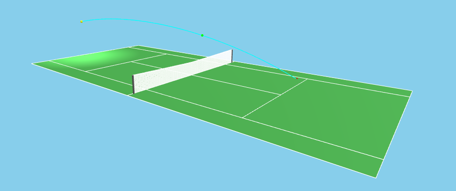

# 3D Tennis Court Simulator

A web-based 3D tennis court visualization tool that simulates realistic ball trajectories with physics-based calculations.



## Overview

This application provides an interactive 3D tennis court where users can place a ball at various positions and observe realistic flight trajectories based on physics parameters including speed, launch angle, and spin. The simulator accounts for gravity, drag forces, and the Magnus effect to create accurate ball flight paths.

## Features

- Fully interactive 3D tennis court with proper dimensions (23.77m × 10.97m)
- Realistic ball trajectory simulation with physics calculations
- Adjustable ball placement (baseline position, distance from baseline, height)
- Configurable ball physics parameters:
  - Speed (km/h) - Ranges from 20-260 km/h with defaults suitable for professional serves
  - Launch angle (degrees) - Controls the vertical angle of the ball's initial trajectory
  - Spin rate (RPM) - Simulates topspin, backspin, and sidespin effects
  - Spin axis (degrees) - Determines the orientation of the spin
- Visual indicators:
  - Color-coded net intersection marker (green when ball clears the net, red when it hits)
  - Net clearance measurement display
  - Ball landing point visualization
  - Ball ground projection
- Camera controls for rotating and zooming the view
- Collapsible control panel for a cleaner interface

## Technical Details

The application is built using:
- Three.js for 3D rendering and visualization
- JavaScript for physics calculations and user interactions
- HTML5 and CSS3 for the user interface
- Flask as the backend web server

The physics model incorporates:
- Gravitational forces (9.81 m/s²)
- Aerodynamic drag based on air density and ball properties
- Magnus effect calculations for spin-induced forces
- Numerical integration to solve the equations of motion

## Usage

1. Adjust the ball's position using the Baseline, Distance, and Height controls
2. Set the desired physics parameters (Speed, Angle, Spin, Spin Axis)
3. The trajectory will automatically update as you change parameters
4. Use mouse to rotate the camera view (click and drag) and zoom (scroll)
5. The net clearance display shows how much the ball clears or hits the net
6. The target sphere shows where the ball would land

## Installation

1. Clone the repository
2. Install the required dependencies:
```console
pip install flask
```
3. Run the application:
```console
python application.py
```
4. Open your browser and navigate to `http://localhost:5000`

## File Structure

- `application.py` - Flask server implementation
- `/static/js/tennis_court.js` - Main JavaScript file with 3D visualization and physics
- `/static/css/style.css` - Styling for the application
- `/templates/index.html` - Main HTML template

## Browser Compatibility

The application works best in modern browsers with WebGL support. If you encounter rendering issues, try:
- Enabling hardware acceleration in your browser settings
- Updating your graphics drivers
- Using a different browser (Chrome, Firefox, or Edge recommended)

## License

[MIT License](LICENSE)

## Acknowledgments

- Three.js library for 3D rendering
- Tennis physics research papers for trajectory calculations