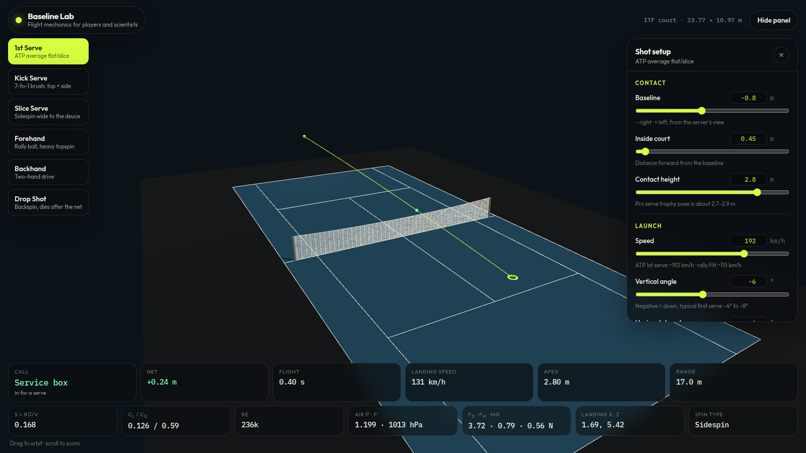

# Baseline Lab

Interactive 3D tennis flight lab for players and for physics / biomechanics work. Place a ball, pick a tour-typical shot, and see a physics-based trajectory on an ITF court (23.77 m × 10.97 m).



## What it models

The ball is a 57 g, 33.5 mm sphere with:

- Gravity
- Aerodynamic drag and Magnus lift (spin parameter \(S = r\omega / v\))
- Moist-air density from **altitude, temperature, and humidity**
- **Felt / fuzz** (worn → new): extra nap radius, higher \(C_D\) / \(C_L\), and spin-down torque
- Heun (RK2) integration of the equations of motion

Default shot is an ATP-average first serve: **192 km/h**, **2.80 m** contact, **2,500 rpm**, **−6°** launch, sea level, 20 °C, 50% RH, mid-wear felt.

## Features

- Shot presets: 1st serve, kick serve (7-to-1 top + side), slice serve, forehand, backhand, drop shot
- Contact, launch, spin, felt, and environment controls
- Live call (service box / in / long / net), net clearance, flight time, landing speed, range, apex
- Lab readouts: \(S\), \(C_L\) / \(C_D\), Reynolds number, \(F_D\) · \(F_M\) · \(mg\), air \(\rho\) and pressure, spin type
- Orbit camera (drag to rotate, scroll to zoom)
- Responsive HUD (bottom sheet on phones)

## Run

```console
make install
make launch
```

Open the URL Vite prints (usually `http://localhost:5173`). `make launch` installs dependencies first if they are missing.

```console
make test         # physics unit tests
make build        # production bundle in dist/
make preview      # serve the production build
make clean        # remove dist/ and node_modules/
```

Needs a modern browser with WebGL. If the court is blank, enable hardware acceleration or try Chrome, Firefox, or Edge.

## Stack

- Vite 8 + Three.js r185
- `src/physics.js` — renderer-free flight model
- Vitest for net height, coefficients, atmosphere, presets, and felt

## Layout

- `index.html` — page shell
- `src/main.js` — Three.js scene and HUD
- `src/physics.js` — ball flight model
- `src/physics.test.js` — unit tests
- `src/presets.js` — ATP-typical shot presets
- `src/style.css` — layout
- `Makefile` — install / launch / test / build
- `assets/baseline-lab.png` — README screenshot

## License

[MIT License](LICENSE)

## Acknowledgments

- Three.js
- Tennis aerodynamics literature (Stepanek, Mehta, Chadwick, Cross) for drag, lift, and felt
